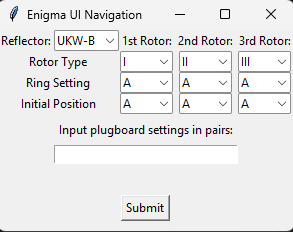
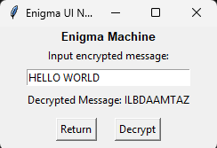
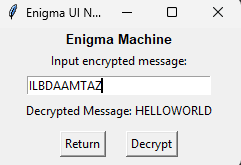

# Enigma Machine Simulator (with GUI)
A fully functional simulation of the WWII-era M3 Enigma encryption machine, complete with a graphical interface built using Tkinter. This project combines historical accuracy with modern usability, letting users experiment with one of the most famous cryptographic devices in history.

## GUI Preview

## Features

- Accurate simulation of:
  - Rotor stepping and double-stepping behavior
  - Configurable plugboard wiring
  - Reversible encryption logic (A → B → A again)
- Tkinter-based GUI for easy interaction
- Customizable rotor selection, ring settings, and initial positions
- Output of encrypted/decrypted messages in real-time
- Modular design: backend and frontend are cleanly separated

## How It Works
<p align="center">
  
</p>
<p align="center">
  <em>Configuration interface: select rotors, ring settings, initial positions, and plugboard pairs</em>
</p>

<p align="center">
  
  
</p>
<p align="center">
  <em>Decryption interface: enter encrypted messages and retrieve the plaintext</em>
</p>

### Encryption Mechanism (`EnigmaMechanism.py`)
The encryption mechanism mirrors the structure of the historical Enigma machine and is split into modular components:

**Rotors**
- Each rotor is initialized with a type, ring setting, and initial position.
- Internally, each rotor has:
  - A forward wiring (from real Enigma models I–V)
  - A reverse wiring for returning signals
  - A turnover notch (e.g., Q for Rotor I), triggering the stepping of adjacent rotors
- Signals pass forward through the rotor, are transformed based on position and ring setting, and then pass back through the reversed wiring after reflection.
- Implements accurate turnover logic, including support for position-dependent stepping (double-stepping detection is handled externally—pending verification with the rest of the system).

**Plugboard**
- The plugboard allows custom letter swaps before and after the rotor path.
- The implementation supports bidirectional mapping (A↔M means M↔A), simulating the actual Enigma plugboard behavior.
- If a letter has no plugboard pairing, it passes unchanged.

**Reflector**
- A fixed, involutory mapping: it sends the signal back through the rotor stack.
- Two reflector wirings are available: UKW-B and UKW-C.
- Ensures the symmetry that makes Enigma encryption reversible.


### Helper Functions (`Helper.py`)
This module contains utility functions essential to the accuracy and usability of the Enigma simulation:

**Rotor Stepping (`step_rotors`)**
- Implements accurate rotor stepping logic, including the double-stepping anomaly:
- The middle rotor steps both when the right rotor reaches its notch and when itself is at its own notch.
- If the middle rotor steps due to its own notch, it also causes the left rotor to step.
- The right rotor steps on every keypress.

**Plugboard Mapping (`pairs_to_dict`)**
- Parses user input like "AM BL CX" into a validated dictionary.
- Ensures each letter is used only once.
- Catches malformed input early.

**Index Conversion (`letter_to_index` / `index_to_letter`)**
- Translates between alphabetical letters and numeric indices (0–25), maintaining case consistency.

**Roman Numeral Parsing (`roman_to_int`)**
- Converts rotor labels like "III" to integers for wiring lookup.
- While not essential to Enigma mechanics, this function improves interface flexibility by accepting historically styled rotor labels.

### Graphical Interface (`Tkinter GUI`)
The application includes a user-friendly interface built with Tkinter, divided into two frames:

**Configuration Frame (`EnigmaConfigFrame`)**
- Allows users to select machine settings via dropdowns:
- Reflector type (UKW-B, UKW-C)
- Rotor order (I–V), ring settings, and initial rotor positions
- Plugboard pairings, entered as space-separated letter pairs (e.g. AM BL CX)
- Validates inputs and raises user-friendly errors when duplicates or malformed pairs are entered

**Result Frame (`ResultFrame`)**
- Handles encryption/decryption:
- On each keypress, rotors are stepped using historically accurate logic (including double-stepping)
- Each character is passed through the plugboard, rotor stack, reflector, and back again
- Non-alphabetic characters are ignored, preserving focus on ciphertext content
- Decryption output is displayed in real time

The GUI is structured using a frame-switching architecture, with a central controller managing navigation between configuration and output views. This separation of concerns keeps the interface logic cleanly decoupled from the underlying encryption mechanism.

## How to Install
### Prerequisites
- Python 3.6 or higher
- Tkinter (usually included with Python by default)
  
### Steps
1. Clone this repository
```bash
git clone https://github.com/CarlosQuijada211/EnigmaMachine.git
cd EnigmaMachine
```
2. Run the application
```bash
python3 EnigmaMachine.py
```
## Acknowledgements
- Inspired by historical reconstructions of the Enigma machine
- Based on documentation from Crypto Museum

